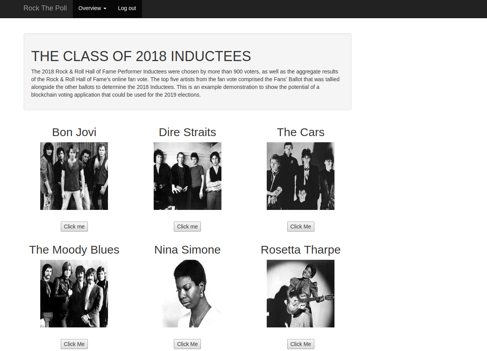

### Team Demo

##### A Presentation going over proposed UI/UX changes to Unibit applications. 

---?image=/assets/image/Light-Grey-Background-Tumblr-8-1024x640.jpg&opacity=100

### Test
slide info

---

### Next Slide!

<br>

@fa[arrows gp-tip](Press F to go Fullscreen)

@fa[microphone gp-tip](Press S for Speaker Notes)

---

### Encryption App


- Current home screen UI design |

---

### Encryption App Modified


- Proposed main screen changes |

---

### Voting App



- Current main screen |

---

### Voting App Modified


- Proposed main screen changes |

---

### UBIT Web Wallet Design


- Current web wallet design |

---

### UBIT Web Wallet Modified


- Proposed web wallet changes |

---

### Features

- Code Presenting |
- Repo Source, Static Blocks, GIST |
- Custom CSS Styling |
- Custom Logo, TOC, and Footnotes |

---

@title[JavaScript Block]

<p><span class="slide-title">JavaScript Block</span></p>

```javascript
// Include http module.
var http = require("http");

// Create the server. Function passed as parameter
// is called on every request made.
http.createServer(function (request, response) {
  // Attach listener on end event.  This event is
  // called when client sent, awaiting response.
  request.on("end", function () {
    // Write headers to the response.
    // HTTP 200 status, Content-Type text/plain.
    response.writeHead(200, {
      'Content-Type': 'text/plain'
    });
    // Send data and end response.
    response.end('Hello HTTP!');
  });

// Listen on the 8080 port.
}).listen(8080);
```

@[1,2](You can present code inlined within your slide markdown too.)
@[9-17](Displayed using code-syntax highlighting just like your IDE.)
@[19-20](Again, all of this without ever leaving your slideshow.)

---

### Template Help

- [Code Presenting](https://github.com/gitpitch/gitpitch/wiki/Code-Presenting)
  + [Repo Source](https://github.com/gitpitch/gitpitch/wiki/Code-Delimiter-Slides), [Static Blocks](https://github.com/gitpitch/gitpitch/wiki/Code-Slides), [GIST](https://github.com/gitpitch/gitpitch/wiki/GIST-Slides) 
- [Custom CSS Styling](https://github.com/gitpitch/gitpitch/wiki/Slideshow-Custom-CSS)
- [Custom Logo](https://github.com/gitpitch/gitpitch/wiki/Logo-Setting) [TOC](https://github.com/gitpitch/gitpitch/wiki/Table-of-Contents) [Footnotes](https://github.com/gitpitch/gitpitch/wiki/Footnote-Setting)

---

### Go GitPitch Pro!

<br>
<div class="left">
    <i class="fa fa-user-secret fa-5x" aria-hidden="true"> </i><br>
    <a href="https://gitpitch.com/pro-features" class="pro-link">
    More details here.</a>
</div>
<div class="right">
    <ul>
        <li>Private Repos</li>
        <li>Private URLs</li>
        <li>Password-Protection</li>
        <li>Image Opacity</li>
        <li>SVG Image Support</li>
    </ul>
</div>

---

### Questions?

<br>

@fa[twitter gp-contact](@gitpitch)

@fa[github gp-contact](gitpitch)

@fa[medium gp-contact](@gitpitch)

---?image=assets/image/gitpitch-audience.jpg&opacity=100

@title[Download this Template!]

### <span class="white">Get your presentation started!</span>
### [Download this template @fa[external-link gp-download]](https://gitpitch.com/template/download/white)

